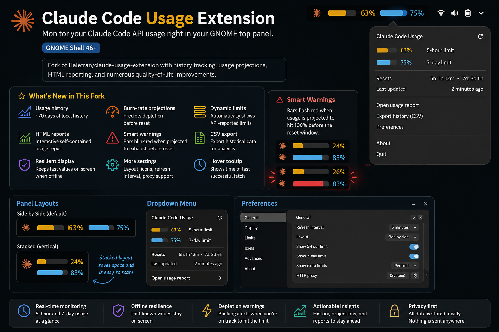
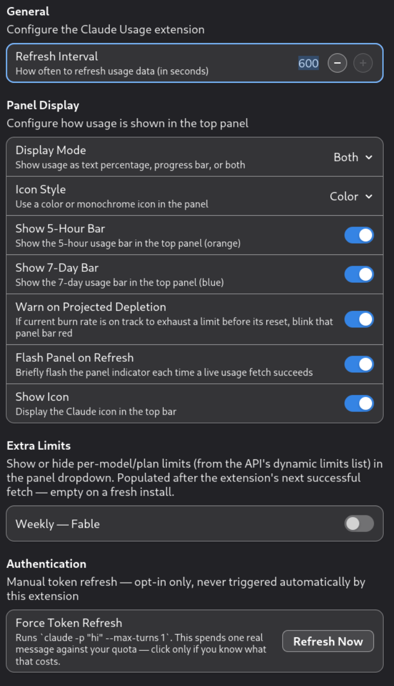

# Claude Code Usage Extension




Displays your Claude Code API usage directly in the GNOME top panel.

> Fork of Haletran/claude-usage-extension. I added history tracking, usage projections, HTML reporting, and a bunch of quality-of-life fixes.

> Companion extension: [grok-usage-extension](https://github.com/bubbabright/supergrok-usage-extension) (Grok Usage), same panel UX for SuperGrok / Grok Build monthly usage. Weekly % is manual there since xAI exposes no weekly API. I keep the two extensions in cosmetic and UX parity.

---

## Table of Contents

- Features
- Related extension
- Screenshots
- CSV Export
- Requirements
- Installation
- License

---

## What's New in This Fork

| Feature | Description |
|---------|-------------|
| 📈 Usage history | ~70 days of local history |
| 📊 HTML reports | Interactive self-contained usage report |
| 📉 Burn-rate projections | Least-squares slope over in-window history; predicts depletion before reset |
| ⚠️ Smart warnings | Blinking indicators when projected to exhaust |
| ➕ Dynamic limits | Automatically shows additional API-reported limits |
| 💾 CSV export | Export historical data |
| 🛡️ Resilient display | Keeps last successful values when offline |
| ⚙️ More settings | Layout, icon styles, refresh interval, proxy support |

---

## Related extension

[grok-usage-extension](https://github.com/bubbabright/supergrok-usage-extension) covers SuperGrok / Grok Build usage with the same panel layout, menu structure, preferences, HTML report, and export conventions. I modeled it on this extension and keep the two in cosmetic and UX parity. The main intentional difference is the data model: this extension auto-polls Anthropic's 5-hour and 7-day limits, while Grok auto-polls monthly billing and uses manual weekly entry because xAI exposes no weekly API.

---

## Screenshots

| Panel | Dropdown | Preferences |
|-------|----------|-------------|
|  |  |  |

### Panel Layouts

| Side by Side | Stacked |
|--------------|---------|
|  |  |

---

## Features

| Feature                  | Description                                                                   |
| --------------------------| -------------------------------------------------------------------------------|
| **Real-time monitoring** | Displays independent 5-hour and 7-day usage bars in the GNOME top panel.      |
| **Flexible layouts**     | Side-by-side or stacked panel bars.                                           |
| **Dynamic limits**       | Automatically discovers additional usage limits exposed by the API.           |
| **Usage projections**    | Least-squares burn rate over in-window history samples.                       |
| **Depletion warnings**   | Warns when usage is projected to reach 100% before reset.                     |
| **History tracking**     | In-memory ring buffer (~20k samples, ~70 days); periodic disk trim.            |
| **HTML reports**         | Generates a portable interactive report.                                      |
| **CSV export**           | Export historical usage for external analysis.                                |
| **Hover tooltip**        | Shows the timestamp of the last successful update.                            |
| **Offline resilience**   | Retains the last successful values and marks them as stale if fetching fails. |
| **Customization**        | Refresh interval, icon style, layout, proxy support, and more.                |

---

## CSV Export

Settings → History → **Export CSV…** writes every recorded sample:

| Column      | Format                                        | Notes                                                                                       |
| -------------| -----------------------------------------------| ---------------------------------------------------------------------------------------------|
| `timestamp` | ISO 8601 UTC, e.g. `2026-07-03T14:00:00.190Z` | Millisecond precision, always UTC (`Z` = Zulu time)                                         |
| `epoch_ms`  | Unix epoch, milliseconds                      | Same instant as `timestamp`, as a plain integer: safe for re-import, no locale/format risk |
| `five_hour` | Number, 0-100                                 | 5-hour rolling-window utilization % at that poll                                            |
| `seven_day` | Number, 0-100                                 | 7-day rolling-window utilization % at that poll                                             |

One row per successful poll (`refresh-interval` setting). Gaps in the timestamps mean the extension couldn't reach the API then (401/429/network), not that usage was zero.

<details>
<summary>Convert <code>timestamp</code> to local Date/Time columns in Excel/Sheets</summary>

`timestamp` is UTC. Paste these into empty columns next to it (adjust `-4/24` for your UTC offset: `-4` for EDT Mar-Nov, `-5` for EST Nov-Mar):

```
Local datetime: =DATEVALUE(LEFT(<timestamp cell>,10))+TIMEVALUE(MID(<timestamp cell>,12,8))-4/24
Local date:     =INT(<the above cell>)
Local time:     =MOD(<the above cell>,1)
```

Format each result cell as **Date** or **Time** (right-click → Format Cells); otherwise the formulas just show raw serial numbers.

</details>

---

## Requirements

- GNOME Shell **46+**
- Claude Code installed and authenticated (`~/.claude/.credentials.json`)

---

## Installation

### Option A: install.sh (recommended)

```bash
git clone https://github.com/bubbabright/claude-usage-extension
cd claude-usage-extension
./install.sh
```

Copies the extension into `~/.local/share/gnome-shell/extensions/`, compiles the schema, and enables it. Re-run after `git pull` to update. Use `./install.sh --dry-run` to preview without changing anything.

No local checkout? One-liner, clones to a temp dir and installs:

```bash
curl -fsSL https://raw.githubusercontent.com/bubbabright/claude-usage-extension/main/remote-install.sh | bash
```

Then restart GNOME Shell:

- **Wayland**: Log out and back in.
- **X11**: Press `Alt+F2`, type `r`, and press Enter.

### Option B: manual

1. Clone the repository.

```bash
git clone https://github.com/bubbabright/claude-usage-extension
```

2. Copy the extension.

```bash
cp -r claude-usage-extension \
  ~/.local/share/gnome-shell/extensions/claude-code-usage@bubbabright
```

3. Compile schemas.

```bash
cd ~/.local/share/gnome-shell/extensions/claude-code-usage@bubbabright/schemas
glib-compile-schemas .
```

4. Restart GNOME Shell.

   - **Wayland**: Log out and back in.
   - **X11**: Press `Alt+F2`, type `r`, and press Enter.

5. Enable the extension using Extensions or Extension Manager.

---

## Related projects

- [grok-usage-extension](https://github.com/bubbabright/supergrok-usage-extension) — same panel UX for SuperGrok / Grok Build, standalone (no daemon needed).
- [ollama-cloud-usage-extension](https://github.com/bubbabright/ollama-cloud-usage-extension) — Ollama Cloud usage, requires [usage-daemon](https://github.com/bubbabright/usage-daemon) running.
- [usage-daemon](https://github.com/bubbabright/usage-daemon) — optional localhost daemon that backs the Ollama extension and can serve any provider over MCP.

---

## License

MIT, see [LICENSE](LICENSE)