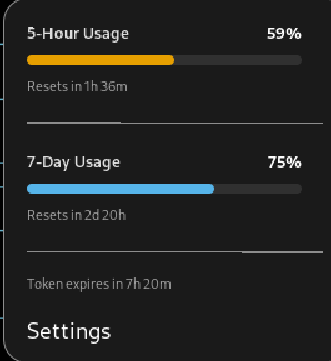

# Claude Code Usage Extension


Claude Code **5-hour** and **7-day** usage in the GNOME top panel.

Fork of Haletran/claude-usage-extension. I added history, burn-rate projections, HTML
report, CSV export, offline last-known, and a pile of QoL fixes. I keep it in cosmetic and
UX parity with my [Grok](https://github.com/bubbabright/supergrok-usage-extension) extension.

## Where this fits

**Standalone by default.** Own engine. Reads `~/.claude/.credentials.json`. Polls Anthropic's
oauth usage API. **No daemon required.** That is the common case: one provider, one bar.

This repo is also the **lab** for the Claude engine that lives as a plugin in
[usage-daemon](https://github.com/bubbabright/usage-daemon). When Anthropic moves the usage
API, I fix it here first, then re-transfer. Dual-mode (prefer the daemon when it is up) is
the suite plan; this extension still self-polls only.

If I want every provider in one panel, I run
[multi-provider-usage-extension](https://github.com/bubbabright/multi-provider-usage-extension)
against the daemon. This repo stays the focused Claude tool.

Standing rule I care about: **never auto-spend quota just to refresh a status token.**
Last-known stays on failure. "Force Token Refresh" is manual and opt-in in Settings.

## Features

| Feature | Description |
|---------|-------------|
| Real-time monitoring | Independent 5-hour and 7-day usage bars in the GNOME top panel. |
| Flexible layouts | Side-by-side or stacked panel bars. |
| Dynamic limits | Additional usage limits the API reports. |
| Usage projections | Least-squares burn rate over in-window history samples. |
| Depletion warnings | Warns when usage is projected to reach 100% before reset. |
| History tracking | In-memory ring buffer (~20k samples, ~70 days); periodic disk trim. |
| HTML reports | Portable interactive report. |
| CSV export | Historical usage for external analysis. |
| Hover tooltip | Timestamp of the last successful update. |
| Offline resilience | Last successful values, marked stale if fetching fails. |
| Customization | Refresh interval, icon style, layout, proxy support, and more. |

## Screenshots

| Panel | Dropdown | Preferences |
|-------|----------|-------------|
|  |  |  |

### Panel layouts

| Side by side | Stacked |
|--------------|---------|
|  |  |

## CSV export

Settings → History → **Export CSV…** writes every recorded sample:

| Column | Format | Notes |
|--------|--------|-------|
| `timestamp` | ISO 8601 UTC, e.g. `2026-07-03T14:00:00.190Z` | Millisecond precision, always UTC |
| `epoch_ms` | Unix epoch, milliseconds | Same instant as `timestamp`, plain integer |
| `five_hour` | Number, 0-100 | 5-hour rolling-window utilization % |
| `seven_day` | Number, 0-100 | 7-day rolling-window utilization % |

One row per successful poll (`refresh-interval` setting). Gaps mean the extension could not
reach the API then (401/429/network), not that usage was zero.

<details>
<summary>Convert <code>timestamp</code> to local Date/Time columns in Excel/Sheets</summary>

`timestamp` is UTC. Paste these into empty columns next to it (adjust `-4/24` for your UTC
offset: `-4` for EDT Mar-Nov, `-5` for EST Nov-Mar):

```
Local datetime: =DATEVALUE(LEFT(<timestamp cell>,10))+TIMEVALUE(MID(<timestamp cell>,12,8))-4/24
Local date:     =INT(<the above cell>)
Local time:     =MOD(<the above cell>,1)
```

Format each result cell as **Date** or **Time** (right-click → Format Cells); otherwise the
formulas just show raw serial numbers.

</details>

## Requirements

- GNOME Shell **46-49**
- Claude Code installed and authenticated (`~/.claude/.credentials.json`)

## Installation

### Option A: install.sh (recommended)

```bash
git clone https://github.com/bubbabright/claude-usage-extension
cd claude-usage-extension
./install.sh
```

Copies the extension into `~/.local/share/gnome-shell/extensions/`, compiles the schema, and
enables it. Re-run after `git pull` to update. Use `./install.sh --dry-run` to preview.

No local checkout? One-liner (clones to a temp dir and installs):

```bash
curl -fsSL https://raw.githubusercontent.com/bubbabright/claude-usage-extension/main/remote-install.sh | bash
```

Then restart GNOME Shell if needed:

- **Wayland**: log out and back in.
- **X11**: `Alt+F2`, type `r`, Enter.

### Option B: manual

```bash
git clone https://github.com/bubbabright/claude-usage-extension
cp -r claude-usage-extension \
  ~/.local/share/gnome-shell/extensions/claude-code-usage@bubbabright
cd ~/.local/share/gnome-shell/extensions/claude-code-usage@bubbabright/schemas
glib-compile-schemas .
```

Restart GNOME Shell, then enable via Extensions / Extension Manager.

## Related projects

- [supergrok-usage-extension](https://github.com/bubbabright/supergrok-usage-extension) (same panel UX for Grok, standalone)
- [ollama-cloud-usage-extension](https://github.com/bubbabright/ollama-cloud-usage-extension) (Ollama thin client; needs daemon)
- [multi-provider-usage-extension](https://github.com/bubbabright/multi-provider-usage-extension) (every daemon provider in one panel)
- [usage-daemon](https://github.com/bubbabright/usage-daemon) (optional hub; Claude plugin already in tree)

## License

MIT, see [LICENSE](LICENSE).
