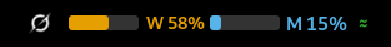
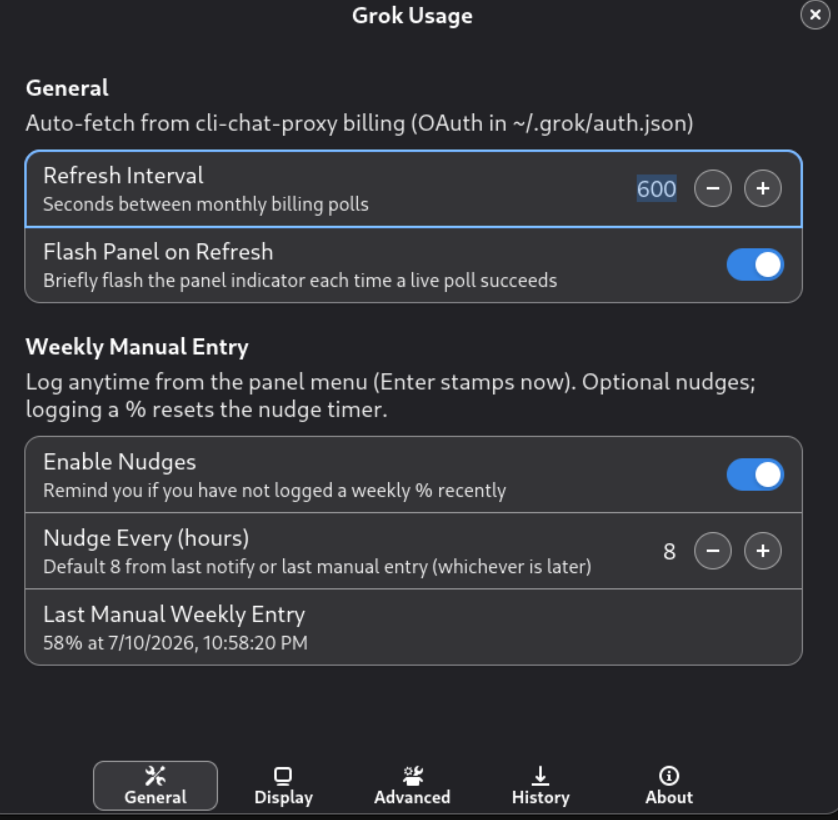

# Grok Usage Extension


SuperGrok / Grok Build usage in the GNOME top panel.

Modeled on my [Claude](https://github.com/bubbabright/claude-usage-extension) extension.
**Monthly** comes from the CLI billing JSON API. **Weekly** SuperGrok pool % is auto-polled
from grok.com's gRPC-web credits endpoint (same surface
[CodexBar](https://github.com/steipete/CodexBar) uses). Manual weekly entry remains available
as a fallback in the product; live auto poll is the primary path.

No headless browser. No Greasemonkey.

## Where this fits

**Standalone by default.** Own engine. Polls grok.com / the CLI billing proxy with the
token from `~/.grok/auth.json` (`grok login`). **No daemon required.**

This is also the **R&D workbench** for Grok. Undocumented endpoints drift. I adapt here,
then copy the proven engine into [usage-daemon](https://github.com/bubbabright/usage-daemon)
as the grok plugin. Multi-provider and the web dashboard then show Grok with zero extension
edits. When xAI moves things, I come back here, re-learn, re-fix, re-transfer. Between
rounds the standalone can deliberately lag. It is a lab, not a second product line I must
keep perfect in isolation forever.

I keep panel UX in parity with the Claude extension. Data model differences stay where they
have to (billing cents, weekly protobuf, etc.).

Dual-mode (prefer the daemon when it is up) is the suite plan. This extension still
self-polls only.

Standing rule: **never auto-spend quota just to refresh a status token.** Force token
refresh is manual. On auth failure, last-known stays dimmed.

## Features

| Feature | Description |
|---------|-------------|
| Monthly monitoring | Polls `cli-chat-proxy.grok.com/v1/billing` and shows a live monthly usage bar. |
| Weekly auto-poll | Polls `GetGrokCreditsConfig` on grok.com (gRPC-web protobuf) for SuperGrok weekly pool % + reset time. |
| Flexible layouts | Side-by-side or stacked panel bars; optional M/W letter prefixes. |
| Usage projections | Least-squares monthly burn rate; warns if on track to exhaust before period end. |
| Depletion warnings | Blinks when projected to reach 100% before period end. |
| History tracking | In-memory ring buffer (~20k samples, ~70 days) of monthly polls and weekly samples. |
| HTML reports | Self-contained offline report: monthly/weekly chart plus burn-rate table. |
| CSV export | Historical usage from the dropdown or Settings. |
| Hover tooltip | Timestamp of the last successful monthly poll. |
| Offline resilience | Last successful values, marked stale if fetching fails. |
| Customization | Refresh interval, icon style, layout, proxy support, and more. |

### Panel menu

- Monthly % (live poll) + billing period dates + last-poll time
- Weekly % (auto-polled) + reset countdown
- Open grok.com Usage, token expiry, Open usage report, Export history (CSV), Settings, About

## Data sources

Auth: Grok CLI OAuth token in `~/.grok/auth.json` (`grok login`).

| Window | Endpoint | Notes |
|--------|----------|--------|
| **Monthly** | `GET https://cli-chat-proxy.grok.com/v1/billing` | JSON: `used`, `monthlyLimit`, period dates. Official CLI surface. |
| **Weekly** | `POST https://grok.com/grok_api_v2.GrokBuildBilling/GetGrokCreditsConfig` | Empty gRPC-web body; protobuf response. `credit_usage_percent` is a fixed32 float (0-100); omitted means **0%** (proto3). Period end at nested timestamp path `1.5.1`. Undocumented; compatible with CodexBar's parser. |

Both poll on the same refresh interval. Weekly failures are quiet (monthly error handling
unchanged). That matches the daemon grok plugin: weekly is best-effort; monthly drives
error state.

## Screenshots

| Panel | Preferences |
|-------|-------------|
|  |  |

### Panel layouts

| Side by side | Stacked |
|--------------|---------|
|  |  |

## HTML report

**Open usage report** (panel menu or Settings → History) writes
`~/.cache/grok-usage/usage-report.html` and opens it in the browser. The file is fully
offline (no CDN, no fetch) with history baked in.

### Chart

- **Monthly (blue)**: auto-polled billing % over time (7-day / 30-day / all-time ranges).
- **Weekly (orange)**: auto-polled SuperGrok pool % over time.
- Hover for timestamps; toggle series and range with the on-page controls.

### Burn-rate table

Below the chart, a **Monthly limit burn rate** table summarizes how fast the billing pool
is being consumed. Values are **Δ monthly % between consecutive auto-polls**, scaled to a
per-period rate:

| | Now | Avg | Peak (date) |
|---|-----|-----|-------------|
| **Hourly** | Latest interval | Mean across intervals | Highest interval + when |
| **Daily** | … | … | … |
| **Weekly** | … | … | … |

Units are `%/h`, `%/day`, and `%/wk` (percentage points of the monthly limit, not dollars).

Cells show **-** until enough poll history exists in the selected range:

| Row | Minimum span for **Now** | Minimum intervals for **Avg** / **Peak** |
|-----|---------------------------|------------------------------------------|
| Hourly | 30 minutes | 2 |
| Daily | 6 hours | 2 |
| Weekly | 1 day | 2 |

More frequent polling fills the table sooner. Regenerate the report after new history
accumulates; it is a static snapshot, not live.

## CSV export

Settings → History → **Export CSV…** (or the dropdown's **Export history (CSV)**) writes
every recorded sample:

| Column | Format | Notes |
|--------|--------|-------|
| `timestamp` | ISO 8601 UTC | Millisecond precision, always UTC |
| `epoch_ms` | Unix epoch, milliseconds | Same instant, plain integer |
| `kind` | `month` or `week` | Which poll produced this row |
| `used` | Number (cents), monthly rows only | Raw `used` from the billing API |
| `limit` | Number (cents), monthly rows only | Raw `monthlyLimit` |
| `pct` | Number, 0-100, monthly rows only | `100 * used / limit` |
| `weekly_pct` | Number, 0-100, weekly rows only | Auto-polled (or fallback) weekly SuperGrok % |

One row per successful monthly poll or weekly sample (weekly logged when its % changes).
Gaps in monthly timestamps mean the billing API was unreachable then, not zero usage.

<details>
<summary>Convert <code>timestamp</code> to local Date/Time columns in Excel/Sheets</summary>

`timestamp` is UTC. Paste these into empty columns next to it (adjust `-4/24` for your UTC
offset: `-4` for EDT Mar-Nov, `-5` for EST Nov-Mar):

```
Local datetime: =DATEVALUE(LEFT(<timestamp cell>,10))+TIMEVALUE(MID(<timestamp cell>,12,8))-4/24
Local date:     =INT(<the above cell>)
Local time:     =MOD(<the above cell>,1)
```

Format each result cell as **Date** or **Time** (right-click → Format Cells); otherwise the
formulas just show raw serial numbers.

</details>

## Requirements

- GNOME Shell **46-49**
- Logged-in Grok CLI (`grok login`) so `~/.grok/auth.json` has a valid access token

## Installation

### Option A: install.sh (recommended)

```bash
git clone https://github.com/bubbabright/supergrok-usage-extension
cd supergrok-usage-extension
./install.sh
```

Copies into `~/.local/share/gnome-shell/extensions/`, compiles the schema, enables. Re-run
after `git pull`. Use `./install.sh --dry-run` to preview.

Then restart GNOME Shell if needed:

- **Wayland**: log out and back in.
- **X11**: `Alt+F2` → `r` → Enter.

### Option B: manual

```bash
git clone https://github.com/bubbabright/supergrok-usage-extension
cp -r supergrok-usage-extension \
  ~/.local/share/gnome-shell/extensions/grok-usage@bubbabright
cd ~/.local/share/gnome-shell/extensions/grok-usage@bubbabright/schemas
glib-compile-schemas .
gnome-extensions enable grok-usage@bubbabright
```

## Troubleshooting

| Symptom | Fix |
|---------|-----|
| Panel stuck on `…` or no numbers | Run `grok login`; confirm `~/.grok/auth.json` exists and `expires_at` is in the future. |
| `401` / auth errors in logs | Token expired: Settings → **Force Token Refresh**, or `grok login` again. |
| Weekly bar never appears | Wait for a successful weekly poll. Token must work against grok.com. Check `journalctl -f -o cat /usr/bin/gnome-shell` for weekly credits errors. |
| Extension not listed / not ACTIVE | First install on Wayland usually needs log out/in; then `gnome-extensions enable grok-usage@bubbabright`. |
| Prefs changes do not apply | `gnome-extensions disable grok-usage@bubbabright && gnome-extensions enable grok-usage@bubbabright`. |
| After `git pull` | Re-run `./install.sh` from the repo root. |
| Report table all **-** | Need more monthly polls in range; lower refresh interval, wait, regenerate. |

Logs: `journalctl -f -o cat /usr/bin/gnome-shell | grep 'Grok Usage:'`

History: `~/.cache/grok-usage/history.jsonl` · Report: `~/.cache/grok-usage/usage-report.html`

## Related projects

- [claude-usage-extension](https://github.com/bubbabright/claude-usage-extension) (Claude standalone)
- [ollama-cloud-usage-extension](https://github.com/bubbabright/ollama-cloud-usage-extension) (Ollama thin client; needs daemon)
- [multi-provider-usage-extension](https://github.com/bubbabright/multi-provider-usage-extension) (every daemon provider in one panel)
- [usage-daemon](https://github.com/bubbabright/usage-daemon) (optional hub; grok plugin already in tree)

## License

MIT, see [LICENSE](LICENSE)
