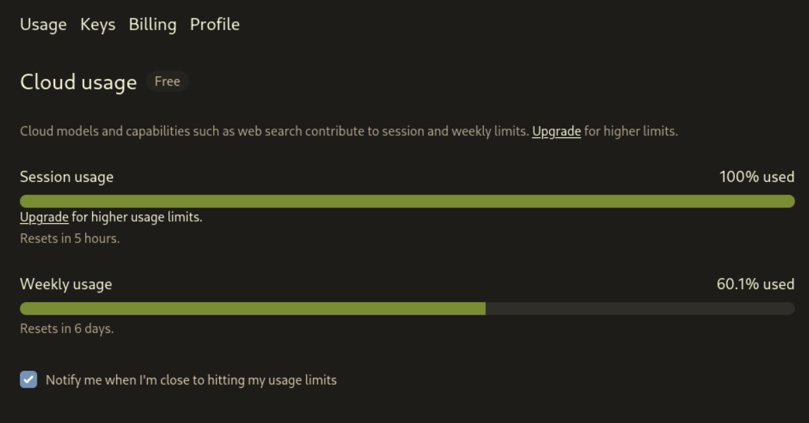
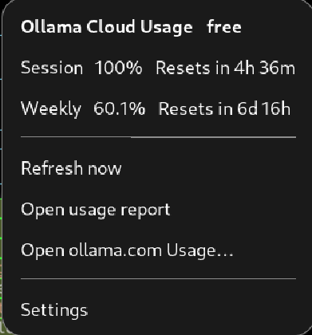

# Ollama Cloud Usage (GNOME)

Ollama Cloud **Session** and **Weekly** in the top panel (two bars + tier).

UUID: `ollama-cloud-usage@bubbabright`

## Where this fits

This extension is a **thin client** of [usage-daemon](https://github.com/bubbabright/usage-daemon).
I paste the ollama.com session cookie once in prefs. The extension forwards it to the daemon
(`POST /usage/ollama/cookie`). The daemon owns the cookie (mode `0600`), the scrape of
ollama.com/settings, history, and burn-rate. This process **never** stores the cookie in
GSettings and **never** scrapes HTML itself.

I built it as the **descriptor-client template**: render `windows[]` the daemon publishes,
do not special-case the provider name. Multi-provider-extension generalizes the same idea
to every plugin.

**Not dual-mode yet.** Unlike Claude and Grok standalones, this extension **requires the
daemon**. Own engine / dual-mode (self-poll when the daemon is down) is still the suite plan,
not what this repo does today.

## Requires

- GNOME Shell 46-49
- [usage-daemon](https://github.com/bubbabright/usage-daemon) running (default
  `http://127.0.0.1:8787`) with the ollama provider enabled

## Install (dev)

```bash
UUID=ollama-cloud-usage@bubbabright
DEST=~/.local/share/gnome-shell/extensions/$UUID
mkdir -p "$DEST"
cp -r extension.js prefs.js stylesheet.css metadata.json schemas assets "$DEST/"
glib-compile-schemas "$DEST/schemas/"
# Wayland: log out/in (or nested shell), then:
gnome-extensions enable "$UUID"
```

## Setup

1. Start the daemon (see its README) and enable this extension.
2. Open preferences → **Cookie** → paste your ollama.com session cookie → **Send to daemon**.
   (Firefox: F12 → Network → reload → click the `settings` request → Request Headers → copy
   the `Cookie` value.)
3. The daemon stores and uses the cookie. The panel fills in on the next client read of
   `GET /usage/ollama/current`.

## Screenshots

| ollama.com Usage page | Panel menu |
|---|---|
|  |  |

## Panel

Renders whatever windows the daemon snapshot returns (today Session + Weekly from the
ollama plugin). Letters, colors, reset times, and `will_deplete` come from the snapshot.
A bar blinks when the daemon projects that window to hit 100% before reset (if the warning
is on). When the daemon is unreachable or the cookie has expired, last-known values stay
(dimmed) with a status line in the menu.

Open report uses the daemon URL `/?provider=ollama`.

## Preferences

- **General**: daemon URL, client refresh interval (how often *I* re-read the daemon; the
  daemon does the real upstream poll).
- **Display**: show/hide icon, tier, bars, letters; stack bars; depletion warning.
- **Cookie**: paste + send to the daemon. Daemon owns the secret.
- **About**.

## Related projects

- [usage-daemon](https://github.com/bubbabright/usage-daemon) (required)
- [multi-provider-usage-extension](https://github.com/bubbabright/multi-provider-usage-extension) (same thin-client idea for every provider)
- [claude-usage-extension](https://github.com/bubbabright/claude-usage-extension) (Claude standalone, own engine)
- [supergrok-usage-extension](https://github.com/bubbabright/supergrok-usage-extension) (Grok standalone, own engine)

## License

MIT, see [LICENSE](LICENSE).
